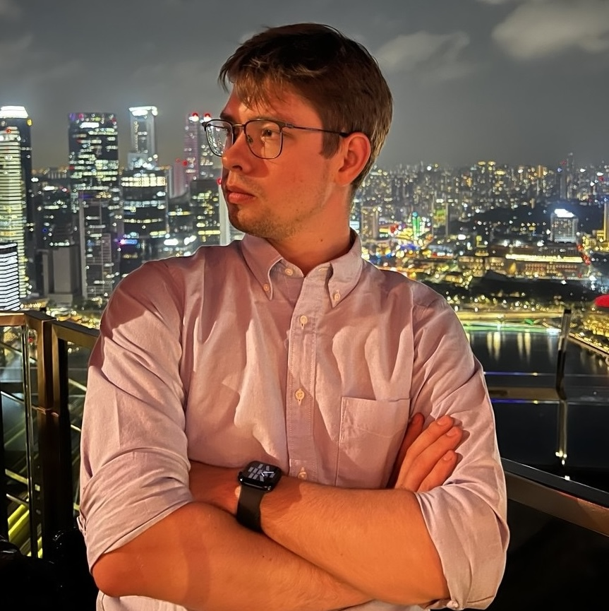

---
# Feel free to add content and custom Front Matter to this file.
# To modify the layout, see https://jekyllrb.com/docs/themes/#overriding-theme-defaults

layout: default
---

Hi, I’m Kirill, a Ph.D. student in Informatics at the University of Edinburgh, where I study probabilistic modeling under the supervision of [Nikolay Malkin](https://malkin1729.github.io/). 

Previously, I worked as a research engineer at Samsung Research, focusing on the development of high-performance, GAN-based speech enhancement models.
I completed my MSc in Applied Mathematics and Computer Science through the “Math of Machine Learning” program jointly offered by HSE University and Skoltech and wrote my Master's thesis under the supervision of [Alexander Korotin](https://akorotin.netlify.app/)

I am interested in researching:
* Diffusion Models
* Energy Based models
* Schrödinger Bridges

Email: K.Tamogashev@sms.ed.ac.uk | [Google Scholar](https://scholar.google.com/citations?user=phcjaXEAAAAJ&hl=en) 

# News

- **February 2025** Started my PhD at the University of Edinburgh.
- **September 2025** My first paper, co-authored with my colleagues from Samsung Research — P. Andreev, N. Babaev, and A. Saginbaev — has been accepted to NeurIPS 2024.
[[paper](https://arxiv.org/abs/2410.05920)] [[page](https://samsunglabs.github.io/FINALLY-page/)] 
